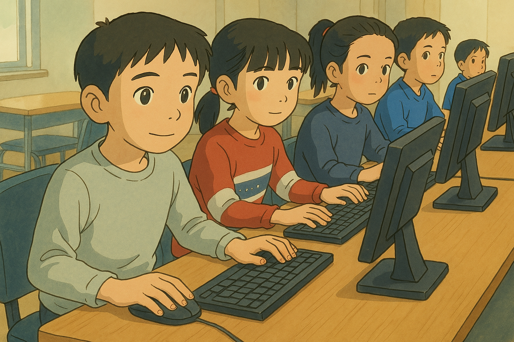
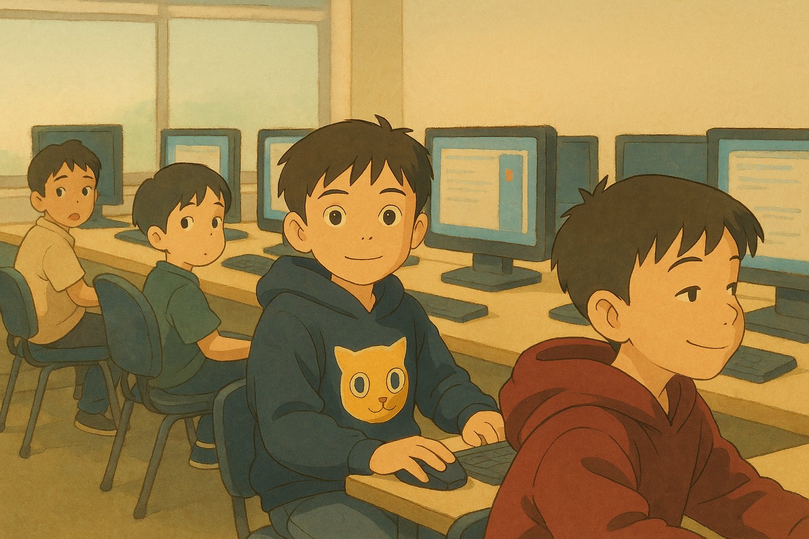

# 2025/04/04

[ikon.mn](https://ikon.mn/n/3dms)\
[Ikon News's FB Post](https://www.facebook.com/iKonNews/posts/pfbid02AbrYdg4jsPvzXvrCZaJTNpdDZWb48KAGZ3xCnwm763axBC44RxENCjFpVdnHzh4hl)

## Хүүхдийнхээ ирээдүйн мэргэжлийг хэдэн наснаас нь төлөвлөх хэрэгтэй вэ?

Хавар болж элсэлтийн ерөнхий шалгалт эхэлмэгц хүүхдээ ямар мэргэжилтэй болгох вэ гэдэг асуудал ихэнх эцэг эхчүүдэд тулгардаг билээ. Гэтэл хөгжингүй орнуудын хувьд хүүхэд уг асуудалтай 12 наснаасаа эхлэн тулгарч, 15 насандаа гүнзгийрэн суралцаж, улмаар 18 насандаа мэргэжлээ сонгодог байна.

Мэргэжил сонгоход хүүхдийн сонирхол, ур чадварыг харгалзахаас гадна ажлын байрны эрэлт хэрэгцээг мөн авч үзэх нь чухал билээ. 

Интернет ертөнцөд байгаа мэдээлэлд тулгуурласан хэд хэдэн хиймэл оюуны (chatgpt, grok, claude, copilot, gemini, deepseek, mistral, perplexity) дүгнэлтээр ирэх 10 жилд өсөх магадлалтай ажлын байруудыг мэдээллийн технологи болон эрүүл мэндийн салбарууд тэргүүлж байгаа бол буурах магадлалтай ажлын байруудыг үйлдвэрийн ажилчин, дэлгүүрийн кассчин, банкны теллер, сэтгүүлч, жолооч, хүргэлтийн ажилчин болон хэрэглэгчийн үйлчилгээний зөвлөх зэрэг ажлын байрууд тэргүүлж байна.

Тодруулбал, дэлхийн төвшинд мэдээллийн технологид суурилсан ажлын байрууд ирэх 10 жилд 15--25 хувиар өсөх хандлагатай байгаа бөгөөд харин тус салбарын хувьд анхан шатны ур чадвартай ажилчдын эрэлт хэрэгцээ буурч болзошгүй төдийгүй хиймэл оюун болон машин сургалт, өгөгдөл шинжлэх, аюулгүй байдал болон үүлэн тооцооллын салбаруудын ажиллах хүчний эрэлт хэрэгцээ өсөх магадлал өндөр байна. Ерөнхийдөө хиймэл оюун хосолсон шинэ мэргэжлүүд бий болж, ажлын байранд зөөлөн ур чадвар болон дижитал ур чадвар хосолсон зайнаас ажиллах шаардлага зонхилох хандлагатай байна гэжээ.

Мэдээллийн технологийг салбар бүрд шаардлагатай ур чадварт зүй ёсоор тооцох болсон хөгжингүй орнууд кодчиллын хичээлийг 5 наснаас эхлэн заах болжээ. Жишээлбэл:

|------------+---------------------|
| Улс        | Код бичиж эхлэх нас |
|------------+---------------------|
| АНУ        | 5-7 нас             |
| Их Британи | 5-7 нас             |
| Герман     | 6-10 нас            |
| Финланд    | 7 нас               |
| Швед       | 7-9 нас             |
| Франц      | 6-10 нас            |
| Япон       | 6-8 нас             |
| Солонгос   | 6-8 нас             |
| Канад      | 6-9 нас             |
| Австрали   | 7-9 нас             |
| Эстони     | 7 нас               |
|------------+---------------------|

Сонирхолтой нь, хөгжиж байгаа орнууд болох Хятад болон Энэтхэгт бүр бага наснаас нь эхлэн кодчиллын хичээлийг зааж байна. Тодруулбал:

|---------+---------------------|
| Улс     | Код бичиж эхлэх нас |
|---------+---------------------|
| Хятад   | 3 нас               |
| Энэтхэг | 4 нас               |
| ОХУ     | 7 нас               |
|---------+---------------------|

Харин манай улсын ерөнхий боловсролын сургуулийн хөтөлбөрт мэдээлэл зүйн хичээл 14 наснаас эхлэн заагдаж байгаа ч кодчиллын хичээл 11-р ангиас буюу 17 наснаас эхлэн орж байгаа юм. Өөрөөр хэлбэл, хөгжингүй орнуудаас дунджаар 10 жилээр хоцорч байна.

Хэрэв бид энэ чигтээ явбал алсдаа мэдээлэл технологийн салбарт олон улсын төвшинд өрсөлдөх чадваргүй болж, программ хангамжийн ихэнх гол бүтээгдэхүүнүүдээ импортоор авч хэрэглэдэг улс болох магадлалтай. Түүнчлэн, манай улсын хэмжээнд мэдээлэл, харилцаа холбооны салбарын 2024 оны орлого өмнөх оныхоос 17.4 хувиар өссөн төдийгүй тус салбарт 30 мянга орчим мэргэжилтэн дутагдсаар байгаа ажээ.

Хүн бүр математикч болох албагүй ч, бага наснаасаа эхлэн математикт суралцдагийн адил мэдээллийн технологиор дагнахгүй ч багаасаа кодчилолд суралцах нь дэлхий нийтийн бодит шаардлага болсон гэдэг нь тодорхой болсон байна.

Кодчилолд суралцах сонирхолтой хүүхдүүдийг 12 наснаас нь эхлэн бэлтгэх, англи хэл компьютер хосолсон, мэргэжлээрээ 20 жилийн туршлага хуримтлуулсан багш нараас бүрдэх манай сургалт нь нийт 5 шаттай, 21 сар үргэлжлэх бөгөөд сургалтад хамрагдсанаар англи хэл болон кодчиллын суурь мэдлэг, ур чадвартай болох юм.

|-----+-------------------------------------+------------------------+----------------|
| Шат | Кодчилол                            | Дагалдах               | Хугацаа        |
|-----+-------------------------------------+------------------------+----------------|
| I   | Компьютерын үндэс                   | Англи хэл (A0)         | 3 сар (48 цаг) |
| II  | Өгөгдлийн бүтэц, Python             | Англи хэл (A1)         | 3 сар (48 цаг) |
| III | Объект хандалтат программчлал, Java | Англи хэл (A2)         | 3 сар (48 цаг) |
| IV  | Алгоритм (анхан)                    | Англи хэл (B1)         | 6 сар (96 цаг) |
| V   | Алгоритм (дунд)                     | Interview, Resume      | 6 сар (96 цаг) |
|-----+-------------------------------------+------------------------+----------------|

Сургалтын хөтөлбөр системчлэгдсэн тул шат бүрд хамрагдах суралцагчид компьютер болон англи хэлний ном товхимлоор хангагдаж, 1 ангид 15 сурагч хичээллэнэ. Суралцагч нь нийт 5 шатны хувьд тухайн шатны нэгдсэн шалгалтын 100 онооноос ядаж 70 оноог авч чадаагүй тохиолдолд давтан суух бөгөөд кодчилол болон англи хэл хамтад нь үзэж байгаа суралцагчийн хувьд нийт 2 удаа үнэгүй давтан суух эрхтэй. Түүнчлэн 4-р шатны нэгдсэн шалгалтаа 95-аас дээш дүнтэй өгсөн суралцагч 5-р шатандаа 40 хувийн хөнгөлөлттэй суралцана.

|----------+------------+--------------+-----------|
| Ээлж     | Гариг      |          Цаг | Хугацаа   |
|----------+------------+--------------+-----------|
| 1-р ээлж | Бямба      | 10:00--14:00 | 240 минут |
| 2-р ээлж | Бямба, Ням | 14:30--16:30 | 120 минут |
| 3-р ээлж | Бямба, Ням | 17:00--19:00 | 120 минут |
| 4-р ээлж | Ням        | 10:00--14:00 | 240 минут |
|----------+------------+--------------+-----------|

👉 **Бүртгүүлэх:** [code.bichig.dev/elselt](https://code.bichig.dev/elselt)

Сургалтын төлбөрийг сар сараар төлж болох бөгөөд 1 сарын төлбөр 500,000 төгрөг, 21 сарын нийт төлбөр 10,500,000 төгрөг болно.

**Хаяг: Баруун 4 зам, барилгын коллежийн хойно**

📢 **МАНАЙ СУРГАЛТЫГ СОНГОХ ШАЛТГААН**

🌟 Компьютерын хэрэглээний болон англи хэлний дунд төвшний мэдлэгтэй болно\
🌟 Хиймэл оюуны хөгжүүлэгч болох суурийг тавина\
🔹 Python, Java хэлний мэдлэг ур чадвартай болно\
🔹 Linux, Vim, Git хэрэгслүүдийг ашиглаж сурна\
🌟 Алгоритмын онолын мэдлэгтэй болж, бодлого бодож сурна\
🌟 Компьютер дээр англи монголоор түргэн бичиж сурна\
🎯 Ажлын ярилцлагад бэлтгэгдэнэ

**Дэлгэрэнгүй мэдээллийг:**

🌐 [code.bichig.dev](https://code.bichig.dev) \
📌 [fb.com/corecode.surgalt](https://fb.com/corecode.surgalt) \
📞 Холбоо барих: 99748867, 99041257, 99164181

[буцах](./)
